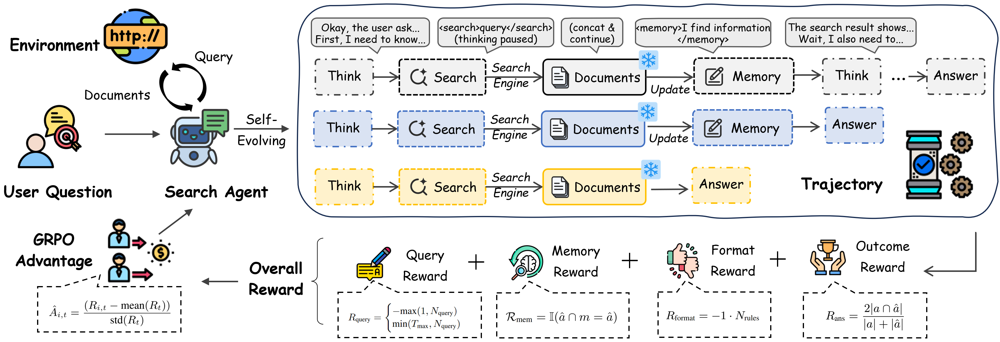
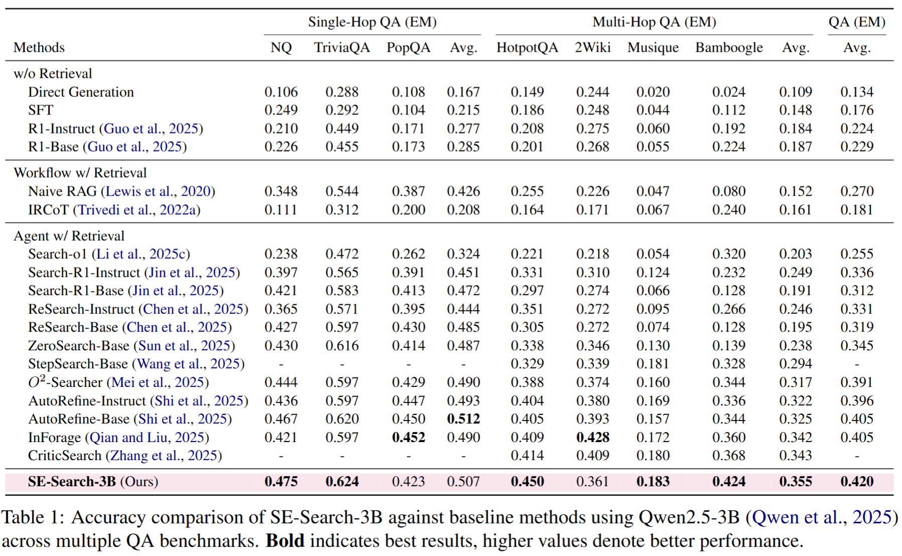

# SE-Search

*Self-Evolving Search Agent via Memory and Dense Reward*

## 🔥 News

- Paper available on \[[ArXiv](https://arxiv.org/abs/2603.03293)\]
- Checkpoints released at \[[🤗 HuggingFace](https://huggingface.co/swordli/SE-Search)\]

## 📖 Overview

SE-Search is a Self-Evolving Search agent that improves online search behavior through a **Think-Search-Memorize** strategy:

- **Memory Purification**: Retains salient evidence while filtering irrelevant content
- **Atomic Query**: Promotes shorter and more diverse queries, improving evidence acquisition
- **Dense Rewards**: Provides fine-grained feedback that speeds up training and improves performance

|  |  |
|:--:|:--:|
| Innovations | Main Results |


## 🛠️ Installation

### Main Environment

```bash
conda create -n sesearch python=3.9
conda activate sesearch
pip install torch==2.4.0 --index-url https://download.pytorch.org/whl/cu121
pip3 install vllm==0.5.4
pip install -e .
pip install flash-attn==2.7.0.post2
pip install wandb
```

### Retrieval Environment

For the local retrieval server:

```bash
conda create -n faiss_env python=3.10
conda activate faiss_env
conda install pytorch==2.4.0 torchvision==0.19.0 torchaudio==2.4.0 pytorch-cuda=12.1 -c pytorch -c nvidia
pip install transformers datasets pyserini
conda install -c pytorch -c nvidia faiss-gpu=1.8.0
pip install uvicorn fastapi
```

## 💫 Quick Start

### 1. Start Retrieval Server

Refer to [Retrieval Corpus](#retrieval-corpus) for preparation.

```bash
conda activate faiss_env
bash retrieval_launch.sh
```

### 2. Run Demo

```bash
conda activate sesearch
python demo.py
```

Starts a Gradio interface for interactive testing.

### 3. CLI Inference

```bash
conda activate sesearch
python infer.py
```

Prints model response to console. Modify `infer.py` to change questions or parameters.

## 📂 Data Preparation

### Retrieval Corpus

```bash
save_path=./data
python preprocess/download.py --save_path $save_path
cat $save_path/part_* > $save_path/e5_Flat.index
gzip -d $save_path/wiki-18.jsonl.gz
```

### Training / Evaluation Dataset

Download from [FlashRAG Collection](https://huggingface.co/datasets/RUC-NLPIR/FlashRAG_datasets):

```bash
bash preprocess/scripts/data_process.sh
```

- **Training**: NQ + HotpotQA merged
- **Test**: `nq`, `triviaqa`, `popqa`, `hotpotqa`, `2wikimultihopqa`, `musique`, `bamboogle`

## 🚀 Reproduction

### Start Retrieval Server

```bash
conda activate faiss_env
bash retrieval_launch.sh
```

Server listens on `http://127.0.0.1:8000/retrieve`

### Training

```bash
conda activate sesearch
bash cmd/train.sh
```

Trains for 300 steps, saving checkpoints with highest reward and evaluation accuracy.

> **Tip**: Set `wandb_token` and `WAND_PROJECT` in scripts to log to Weights & Biases.

### Evaluation

```bash
conda activate sesearch
bash cmd/eval.sh
```

## 🙏 Acknowledgements

Built upon [VeRL](https://github.com/volcengine/verl), [Search-R1](https://github.com/PeterGriffinJin/Search-R1), and [AutoRefine](https://github.com/syr-cn/AutoRefine). Thanks to the authors for their valuable work.

## 🎓 Citations

```latex
@misc{li2026sesearch,
      title={SE-Search: Self-Evolving Search Agent via Memory and Dense Reward}, 
      author={Jian Li and Yizhang Jin and Dongqi Liu and Hang Ding and Jiafu Wu and Dongsheng Chen and Yunhang Shen and Yulei Qin and Ying Tai and Chengjie Wang and Xiaotong Yuan and Yabiao Wang},
      year={2026},
      eprint={2603.03293},
      archivePrefix={arXiv},
      primaryClass={cs.CL},
      url={https://arxiv.org/abs/2603.03293}, 
}
@misc{li2026improvingsearchagentline,
      title={Improving Search Agent with One Line of Code}, 
      author={Jian Li and Dongsheng Chen and Zhenhua Xu and Yizhang Jin and Jiafu Wu and Chengjie Wang and Xiaotong Yuan and Yabiao Wang},
      year={2026},
      eprint={2603.10069},
      archivePrefix={arXiv},
      primaryClass={cs.LG},
      url={https://arxiv.org/abs/2603.10069}, 
}
@article{li2025survey,
  title={A Survey on AI Search with Large Language Models},
  author={Li, Jian and Li, Xiaoxi and Zheng, Yan and Jin, Yizhang and Wang, Shuo and Wu, Jiafu and Wang, Yabiao and Wang, Chengjie and Yuan, Xiaotong},
  year={2025}
}

```
